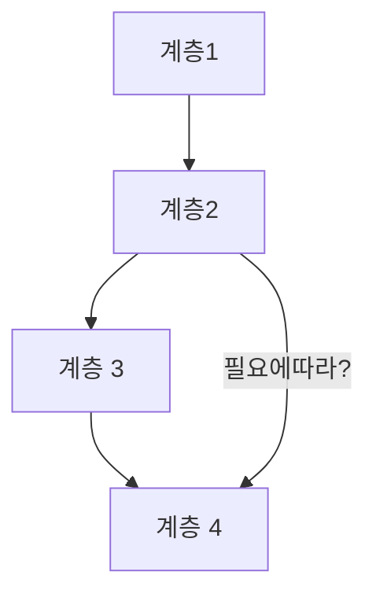
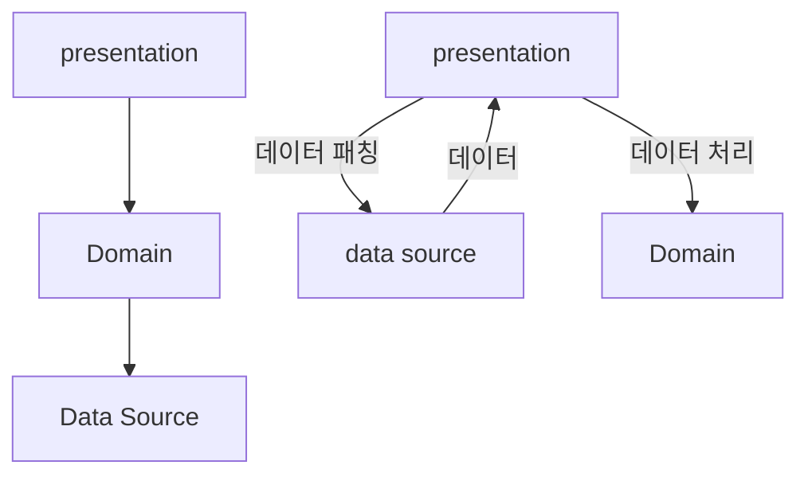

# 1장 - 계층화

- 복잡한 소프트웨어 시스템을 분할하는 데 사용하는 가장 일반적인 기법
- 상위 계층은 하위 계층이 정의하는 다양한 서비스를 사용, 그러나 하위 계층은 상위계층을 인식하지 못함
- 보통 계층을 뛰어넘어 보지 못하도록 한다.
  - 나는 이것이 크게 중요하진 않다고 본다. 아래로만 가면 된다고 생각함.
  - 결합도의 문제는 있을 수 있지만 그다지 크게 중요하지 않다고 생각한다.

## 이점

- 다른 계층에 대한 정보 없이 단일 계층을 하나의 일관된 계층으로 이해 가능함.
- 동일한 기본 서비스를 가진 대안 구현으로 계층 대체 가능.
- 계층 간 의존성 최소화
- 계층은 표준화 하기 좋은 위치임.
- 한번 구축한 계층은 다른 상위 서비스에서 이용할 수 있음.

## 단점

- 계층은 캡슐화가 효과적이지 않다.
  - 뭔가 변경했을때 다른 계층에 영향을 미칠 수 있음.
  - ui에 보여줘야하는 어떤 field를 변경했을때 data 까지 전부 변경해야 할 수 있기 때문에 모든 중간계층에 필드를 추가해주어야 할 수 있음.
- 계층을 추가하면 성능이 저하된다.
  - 각 계층에서는 정보를 다른 표현으로 변환해야하는데 이는 성능 저하를 야기할 수 있다.
  - 다만, 기반 기능을 캡슐화한다면 효율을 향상시킬수도 있다.
    - 캡슐화된 곳만 최적화하면 전체가 빨라짐

## 계층의 발전

### Layer !== Tier

#### Tier

- 물리적 분리를 함축하는 경우가 많음.
- 클라이언트-서버 시스템에서 클라이언트는 데스크톱에, 서버는 서버에 있으므로 물리적으로 분리되어있어 2티어 시스템이라고 불림

#### Layer

- 물리적으로 분리되지 않고 단일 시스템에서 실행하지만 분리되어있음

## 세가지 주요 계층

| 계층         | 역할                                                                                                              |
| ------------ | ----------------------------------------------------------------------------------------------------------------- |
| 프레젠테이션 | 서비스 제공, 정보 표시(창 or HTML), 사용자 요청(마우스 클릭, 키 누름), HTTP 요청, 명령줄 호출, 일괄 작업 API 처리 |
| 도메인       | 시스템의 핵심이 되는 논리                                                                                         |
| 데이터 원본  | 데이터베이스, 메시징 시스템, 트랜잭션 관리자 및 다른 패키지와의 통신                                              |

### 프레젠테이션 (presentation)

- 사용자와 소프트웨어 간 상호작용 처리
- 사용자에게 정보를 표시, 사용자가 내릴 명령을 도메인과 데이터 원본에서 수행할 작업으로 해석하는 것

### 데이터 원본 (data source)

- 어플리케이션을 대신해 다른 시스템과 통신
  - 트랜잭션 모니터, 다른 애플리케이션, 메시징 시스템 등
  - 대부분은 데이터베이스

### 도메인 논리 (domain logic)

- 비즈니스 로직
- 입력과 저장된 데이터를 바탕으로 하는 계산
- 데이터의 유효성 검사

> 모든 외부 요소를 근본적으로 외부 인터페이스로 나타내는 대칭 뷰의 헥사고날에 대해 마틴 파울러는 다른 사람에게 서비스로 제공하는 인터페이스와 다른 사람의 서비스를 사용하기 위한 인터페이스를 구분할 수 있는 비대칭이 유용하다고 생각한다고 한다.
