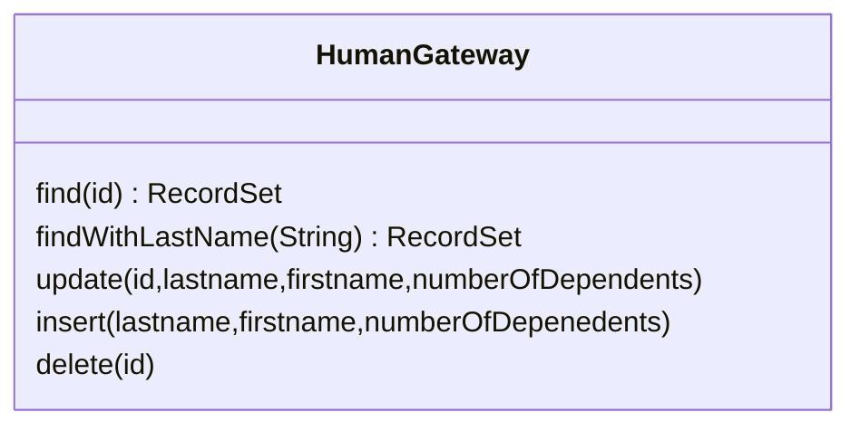
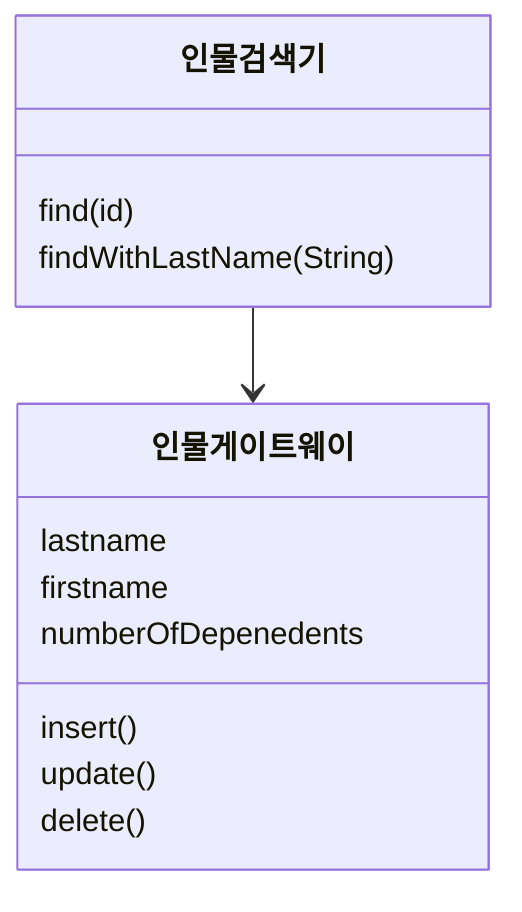
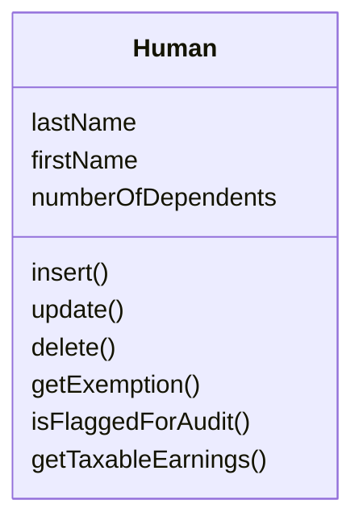
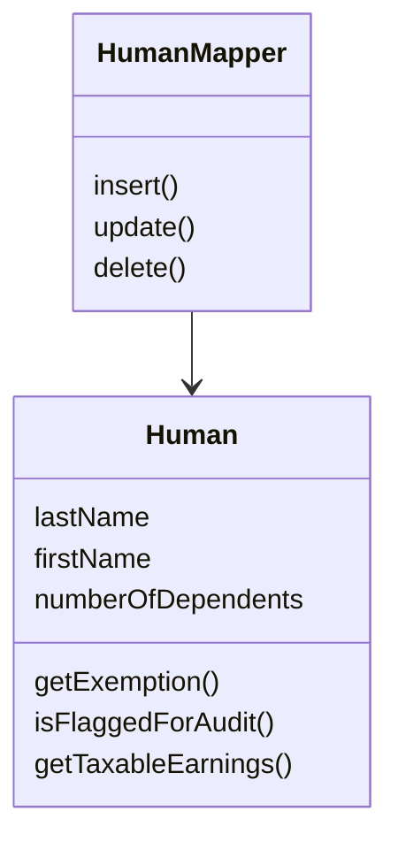
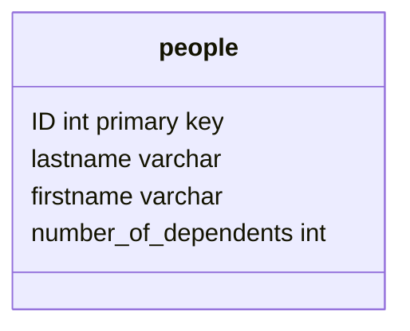

# 10장 - 데이터 원본 아키텍처 패턴

## 테이블 데이터 게이트웨이



SQL을 애플리케이션 논리와 혼합하면 문제가 유발될 수 있음

### 작동 원리

- 데이터베이스에서 데이터를 얻는 여러 검색 메서드와 갱신, 삽입, 삭제 메서드로 구성된 인터페이스를 가짐 (repository?)
- 쿼리로부터 정보를 반환하는 방법
  - DTO
  - 레코드 집합
  - 도메인모델

### 사용 시점

- 데이터베이스 인터페이스 패턴으로 캡슐화

### 예제

데이터 베이스의 인물 테이블에 연결하는 인물 게이트웨이 클래스

```C#
class PersonGateway {
  public IDataReader FindAll() {
    String sql = "select  * from person";
    return new OleDbCommand(sql, DB.Connection).ExecuteReader();
  }

  public IDataReader FindWithLastName(String lastName){
    String sql = "SELECT * FROM person WHERE lastname = ?";
    IDbCommand comm = new OleDbCommand(sql, DB.Connection);
    comm.Parameters.Add(new OleDbParameter("lastname", lastName));
    return comm.ExecuteReader()
  }

  public IDataReader FindWhere(String whereClause) {
    String sql = String.Format("SELECT * FROM person WHERE {0}", whereClause);
    return new OleDbCommand(sql, DB.Connection).ExecuteReader();
  }

  public FindRow (long key){
    String sql = "SELECT * FROM person WHERE id = ?";
    IDbCommand comm = new OleDbCommand(sql, DB.COnnection);
    comm.Parameters.Add(new OleDbParameter("key", key));
    IDataReader reader = comm.ExecuteReader();
    reader.Read();
    Object [] result = new Object[reader.FieldCount];
    reader.GetValues(result);
    reader.Close();

    retrun result;
  }

  public void Update (long key, String lastname, String firstname, long numberOfDependents) {
    String sql = @"UPDATE person SET lastname = ?, firstname = ?, numberOfDependents = ? WHERE id = ?";
    IDbCommand comm = new OleDbCommand(sql, DB.Connection);
    comm.Parameters.Add(new OleDbParameter("last",lastname));
    comm.Parameters.Add(new OleDbParameter("first",firstname));
    comm.Parameters.Add(new OleDbParameter("numDep",numberOfDependents));
    comm.Parameters.Add(new OleDbParameter("key",key));
    comm.ExecuteNoneQuery();
  }

  public void INSERT (String lastname, String firstname, long numberOfDependents) {
    long key = GetNextID();
    String sql = "INSERT INTO person VALUES (?,?,?,?);"
    IDbCommand comm = new OleDbCommand(sql, DB.Connection);
    comm.Parameters.Add(new OleDbParameter("key",key));
    comm.Parameters.Add(new OleDbParameter("last",lastname));
    comm.Parameters.Add(new OleDbParameter("first",firstname));
    comm.Parameters.Add(new OleDbParameter("numDep",numberOfDependents));
    comm.ExecuteNoneQuery();
    return key;
  }

  public void Delete(long key) {
    String sql = "DELETE FROM person WHERE id = ?";
    IDbCommand comm = new OleDbCommand(sql, DB.Connection);
    comm.Parameters.Add(new OleDbParameter("key",key));
    comm.ExecuteNoneQuery();
  }
}
```

## 행 데이터 게이트웨이



- 데이터소스 단일 레코드에 대한 게이트웨이 역할을 하는 객체, 행마다 인스턴스 하나 사용

### 작동원리

- 데이터베이스 행 하나와 같이 정확하게 단일 레코드를 흉내내는 객체
- 이 패턴을 생성하는 검색 작업을 어디서 해야할 지 결정해야함.
- 행 데이터 게이트웨이와 활성 레코드 간의 차이
  - 도메인 논리가 있는 지 여부
    - 있으면 활성 레코드
    - 행 데이터 게이트웨이는 데이터베이스 접근 논리만 포함

### 사용 시점

- 트랜잭션 스크립트를 사용할 때 제일 많이 사용함
- 도메인 모델에서는 활성 레코드, 또는 데이터 매퍼가 더 좋은 선택
- 도메인 객체를 데이터베이스 구조로부터 보호하는 데에도 사용
  - 자료구조를 변경해도 도메인 로직은 변경안함

## 활성 레코드



- 데이터 접근 논리, 데이터, 도메인 논리가 모두 포함된다.

### 사용 시점

- 단순하기 대문에 도메인 모델의 초기버전에 사용
  - 내가볼땐 안씀

## 데이터 매퍼



- 객체를 데이터베이스로 분리하는 계층

### 작동 원리

- 각 도메인 클래스나 계층의 루트마다 하나씩 만드는 것이 좋다.
- 데이터를 도메인 필드로 매핑
- 메타데이터 매핑
  - 조금 느릴 순 있지만 코드 추가작성이 필요없음

### 사용 시점

- 사용하는 주된 이유는 데이터베이스 스키마와 객체 모델을 분리해서 발전시킬 수 있음
  - 도메인 모델과 함께 사용하는 경우

### 예제



```java
class Person {
  private String lastName;
  private String firstName;
  private int numberOfDependents
}

class PersonMapper {
  protected String findStatement(){
    return "SELECT " + COLUMNS + " FROM people" = " WHERE id = ?";
  }

  public static final String COLUMNS = " id, lastname, firstname, number_of_dependents ";

  public Person find(long id){
    return (Person) abstractFind(id);
  }

  public Person find(long id) {
    return find(new Long(id));
  }

  protected DomainObject doLoad(Long id, ResultSet rs) throws SQLException {
    String lastNameArg = rs.getString(2);
    String firstNameArg = rs.getString(3);
    int numDependentsArg = rs.getInt(4);
    return new Person(id, lastNameArg, firstNameArg, numDependentsArg);
  }
}

class AbstractMapper {
  protected Map loadedMap = new HashMap();
  abstract protected String findStatement();

  protected DomainObejct abstractFind(Long id){
    DomainObject result = (DomainObject) loadedMap.get(id);
    if (result != null) return result;
    PreparedStatement findStatement = null;
    try{
      findStatement = DB.prepare(findStatement());
      findStatement.setLong(1, id.longValue());
      ResultSet rs = findStatement.executeQuery();
      rs.next();
      result = load(rs);
      return result;
    } catch (SQLException e) {
      throw new ApplicationException(e);
    } finally {
      DB.cleanUp(findStatement);
    }
  }

  // 추추상매퍼는 ID를 확인하고 데이터에서 ID를 가져온 후 새로운 객체를 식별자 맵에 등록한다.
  protected DoaminObject load(ResultSet rs) throws SQLException {
    Long id = new Logn(rs.getLong(1));
    // 캐싱
    if (loadedMap.containsKey(id)) return (DomainObject) lodedMap.get(id);
    DomainObject result = doLoad(id, rs);
    loadedMap.put(id, result);
    return result;
  }

  abstract protected DomainObject doLoad(Long id, ResultSet rs) throws SQLException;
}
```

### 예제: 비어 있는 객체 만들기

1. 생성자를 이용해 처음부터 유효한 객체를 만드는 방식

```java
class AbstractMapper {
  protected DomainObject load(ResultSet rs) throws SQLException {
    Long id = new Long(rs.getLong(1));
    if (loadedMap.containsKey(id)) return (DomainObject) loadedMap.get(id);
    DomainObject result = doLoad(id,rs);
    loadedMap.put(id,result);
    return result;
  }

  abstract protected DomainObject doLoad(Long id, ResultSet rs) throws SQLExceptiono;
}

class PersonMapper {
  abstract DomainObject doLoad(Long id, resultSet rs) throws SQLException{
    String lastNameArg = rs.getString(2);
    String firstNameArg = rs.getString(3);
    Int numDependentsArg = rs.getString(4);
    return new Person(id, lastNameArg, firstNameArg, numDependentsArg)
  }
}
```

2. 비어있는 객체 만든 후 setter를 이용해 객체를 로드하는 방식

```java
class AbstractMapper {
  protected DomainObjectEL load(ResultSet rs) throws SQLException {
    Long id = new Long(rs.getLong(1));
    if (loadedMap.containsKey(id)) return (DomainObjectEL) loadedMap.get(id);
    DomainObjectEl result = createDomainObject();

    result.setID(id);
    loadedMap.put(id,result);
    doLoad(result,rs);
    return result;
  }

  abstract protected DomainObjectEL createDomainObject()
  abstract protected void doLoad(DomainObjectEL obj, ResultSet rs) throws SQLException;
}

class PersonMapper {
  protected DomainObjectEL createDomainObject(){
    return new Person();
  }

  protected void doLoad(DomainObjectEL obj, ResultSet rs) throws SQLException {
    Person person = (Person) obj;
    person.dbLoadLastName(rs.getString(2));
    person.setFirstName(rs.geteString(3));
    person.setNumberOfDependents(rs.getInt(4));
  }

  class DomainObejctEL {
    private int state = LOADING;
    private static final int LOADING = 0;
    private static final int ACTIVE = 1;

    public void beActive() {
      state = ACTIVE;
    }

    void assertStateIsLoading() {
      Assert.isTrue(state === Loading);
    }
  }

  class Person {
    public void dbLoadLastName(String lastName){
      assertStateIsLoading();
      this.lastName = lastName;
    }
  }
}
```

- 업데이트 메서드를 잘못 호출해서 생기는 버그는 포착하지만 인터페이스에 인물 클래스의 클라이언트 대다수가 사용할 수 없는 메서드가 추가됨
