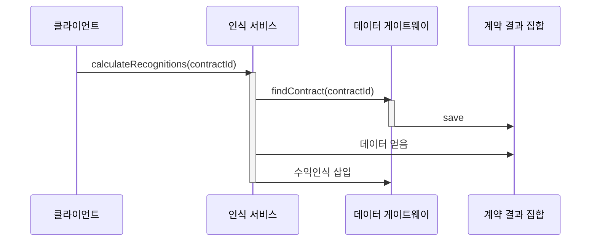
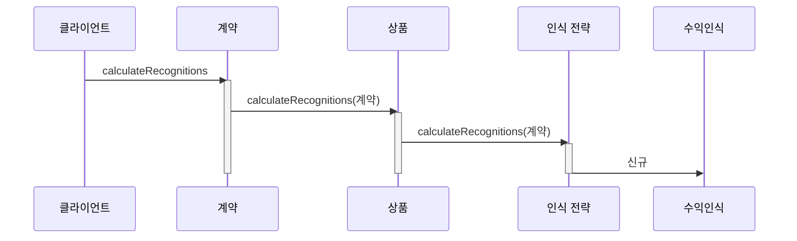
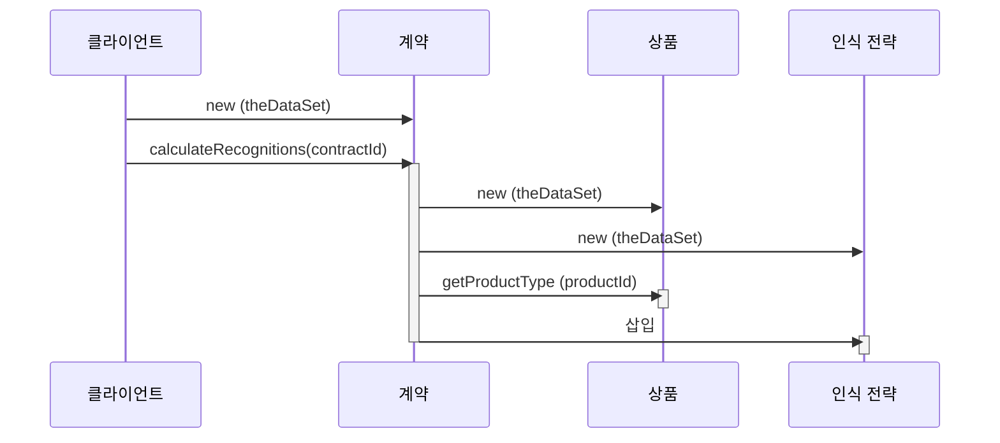

# 2장 - 도메인 논리 구성

아래의 3가지 주요 패턴으로 분리했다.

## 1. 트랜잭션 스크립트

- 가장 간단한 방식
- 프레젠테이션에서 입력을 받고 유효성 검사와 계산을 통해 입력을 처리하고 데이터 베이스에 저장, 다른시스템에서 작업을 호출하는 프로시저
- 그 후 필요에 따라 응답을 구성하고 서식을 지정하는 계산을 더 수행, 추가 데이터로 프레젠테이션에응답.
- 기본 구성은 사용자가 수행할 각 작업마다 프로시저를 하나씩 만드는 것.
- 작업 또는 비즈니스 트랜잭션마다 스크립트 하나를 만드는 패턴
- 코드를 서브루틴으로 분리하고 여러 다른 트랜잭션 스크립트에서 공유할 수 있다.

### 장점

- 대부분의 개발자가 이해할 수 있는 간단한 절차적 모델
- 행 데이터 게이트웨이나 테이블 데이터 게이트웨이를 적용해 데이터 원본 계층과 함께 사용하기에 적합
- 트랜잭션의 경계를 설정하기 쉽다. 트랜잭션 열기와 함께 시작하고 닫기와 함께 종료함.

### 단점

- 도메인 로직이 늘어나며 복잡도가 상승하는 결과로 주로 나타남.
- 여러 트랜잭션이 비슷한 작업을 수행해야 되기 때문에 코드 중복이 늘어남.
- 공통 서브루틴을 뽑아내 어느정도는 해결할 수 있지만 중복제거가 어려움

## 2. 도메인 모델

- 도메인에 있는 명사를 바탕으로 도메인과 비슷한 모델을 구축함.
  - 임대 시스템을 위해 `임대`, `자산` 등의 크래스를 만들 수 있음.
  - 유효성 검사와 계산 등은 도메인 모델 안에 넣을 수 있음.
- 각 객체가 관련된 논리의 일부를 담당하게 한다.

## 트랜잭션 스크립트 vs 도메인 모델

### 트랜잭션 스크립트

### 도메인 모델

## 3. 테이블 모듈

- 테이블 모듈은 계약, 상품, 수익 인식 클래스를 가진다 (like 도메인 모델)

### 도메인 모델 vs 테이블 모듈

- 도메인 모델은 데이터베이스에서 각 계약마다 계약 인스턴스가 있다.
- 테이블 모듈은 인스턴스가 단 하나이다.
  - 레코드 집합과 함께 사용하도록 설계돼 있다.
- 데이터베이스에 쿼리를 수행해 레코드 집합을 얻고 레코드 집합을 인수로 전달해 계약 객체를 만든다.

## 선택

- 도메인 로직의 복잡도에 따라 달라진다.
- 트랜잭션 스크립트와 테이블 모듈은 도메인 복잡도가 높아질수록 개선 하기가 매우 어려워진다.
- 도메인 모델 패턴은 초기에는 개선이 어렵지만 복잡해질수록 다른 패턴들에 비해 적은 노력으로 개선이 가능해진다.

## 서비스 계층

- 도메인 로직을 처리하는 방법은 도메인 계층을 둘로 나누는것이 일반적
- 서비스 계층은 명확한 API를 제공하며 트랜잭션 제어와 보안과 같은 기능을 넣기도 좋다.
- 여기에 얼마나 많은 동작을 넣을지 결정하는 것은 중요한 일임.
  - 가장 소극적인 방법
    - 파사드로 만들고 실제 모든 동작을 기반 객체에 넣고 서비스 계층이 파사드에 대한 호출을 하위 객체로 전달하게 하는 것.
    - 이 경우 use case를 반영하여 구성된 사용하기 쉬운 API를 제공한다.
  - 극단적 사례
    - 대부분 비즈니스 논리를 서비스 계층 안의 트랜잭션 스크립트에 넣는 것.
    - 기본 도메인 객체는 아주 간단하고 데이터베이스와 일대일이므로 활성 레코드와 같은 간단한 데이터소스 계층을 사용할 수 있다.
  - 중간 (`컨트롤러-엔티티`)
    - 한 트랜잭션이나 use case에 적용되는 로직을 트랜잭션 스크립트에 넣는 것.
      - 이를 컨트롤러나 서비스라고 한다.
        - MVC 의 입력 컨트롤러나 application controller와는 다르기 때문에 책에서는 use-case controller라는 용어를 사용할 것
