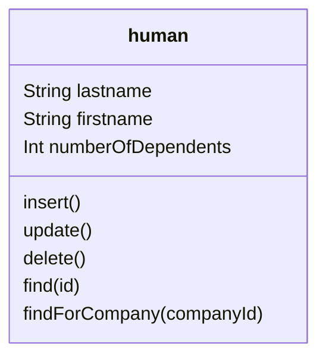
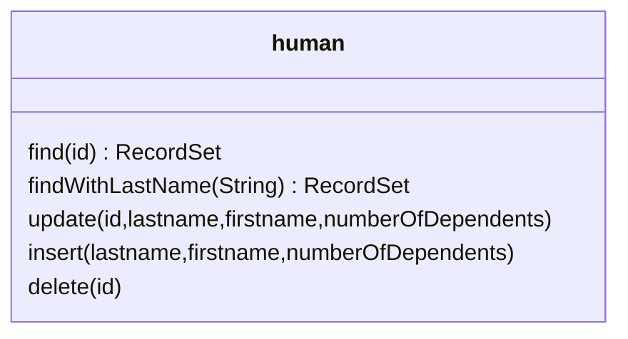
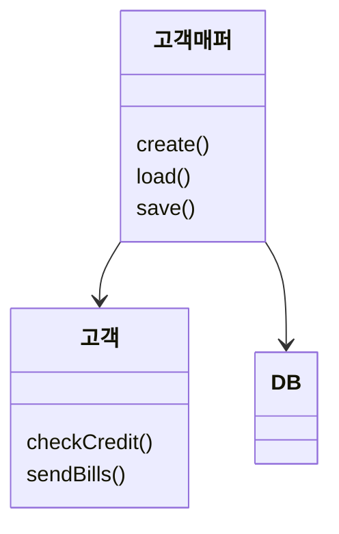
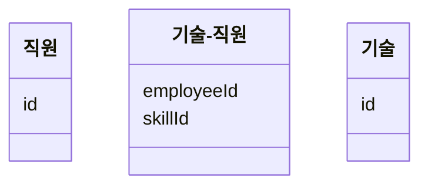
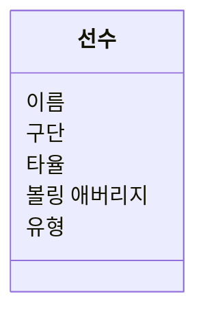
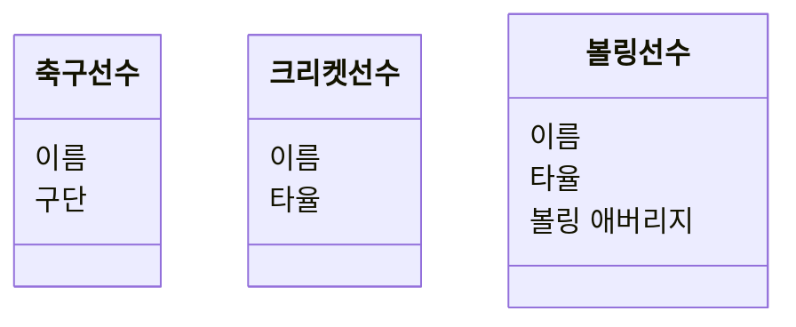
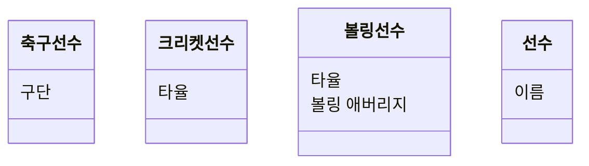

# 3장 - 관계형 데이터베이스 매핑

- 데이터 원본 계층의 역할은 필요한 인프라의 다양한 부분과 통신하는것
- 그 중 가장 중요한건 데이터베이스와 상호작용하는 것
  - 일반적으로 RDB

## 아키텍처 패턴

- 도메인 로직이 데이터베이스와 상호작용하는 방법을 좌우하는 패턴집합

### 행 데이터 게이트웨이



- 데이터베이스 테이블 당 클래스 하나
- 쿼리가 반환하는 각 행마다 인스턴스 하나를 만드는 것
- 데이터에 대한 객체지향적 사고방식과 자연스럽게 잘 어울림

### 테이블 데이터 게이트웨이



- 쿼리 결과로 레코드 집합을 반환하는 메서드를 제공함
- GUI 툴에서 많이 사용하는듯(?)
- 레코드 집합과 잘 어울리므로 테이블 모듈을 사용하는 경우 좋다.
- 저장 프로시저를 정리할 때도 이 패턴을 고려할 수 있다.

> 도메인 모델을 사용할때 행 데이터 게이트웨이나 테이블 데이터 게이트웨이를 함께 사용할 수 있다. 다만 이 두 옵션은 간접성이 너무 많거나 부족하다.
> 이 경우 도메인 모델이 데이터베이스 스키마와 밀접하게 결합되는 것을 막지 못한다.
>
> JPA나, typeORM처럼 어노테이션, 데코레이터 등을 사용하여 도메인 모델에 하는것은 엔티티 == 도메인 모델인데 이건 뭐지...?

## 데이터 매퍼 (data mapper)

데이터 매퍼는 두 계층을 격리한다는 장점을 제공한다.



## 동작 문제

- O/R 매핑을 활용할 때 가장 어려운 측면은 아키텍처와 동작 측면
- 동작 문제는 객체가 데이터베이스에 저장 및 로드되는 방법에 대한 것
- 다수의 객체를 메모리로 로드하고 수정할 때 객체를 데이터베이스에 올바르게 기록하기 위해 수정한 객체를 모두 추적해야 한다.
  - 객체를 읽고 수정하는 동안에는 데이터베이스 상태를 일관되게 유지해야한다.
    - 동시성 문제

### 작업 단위

- 데이터베이스에서 읽은 객체와 함께 이후 다양한 방법으로 수정한 객체를 추적하고 데이터베이스를 업데이트 함.

1. 어플리케이션은 db를 직접 호출하지 않고 작업 단위에 커밋을 요청
2. 데이터베이스에 수행할 모든 동작을 적절한 순서로 정리 후 커밋을 위한 복잡한 모든 작업을 한곳에서 처리

- 데이터베이스 매핑의 컨트롤러로 작동하는 객체
- 객체 로드 시 같은 객체가 두 번 로드하지 않게 주의해야하는데, 같은 객체를 두 번 로드하게 되면 같은 db 행과 연결된 인메모리 객체가 두개가 되어 모두 업데이트 시 오류가 날 수 있다. 이때 읽은 모든 행의 기록을 `식별자 맵`을 이용하여 추적하면 문제를 예방 가능하다.

  - 식별자 맵은 캐시를 늘려서 불필요한 호출을 줄이는 효과도 있다
    - 주요 효과는 아니고 식별자를 올바르게 유지하는 것이 주요 기능

- 도메인 모델을 사용할 때 db에서 객체를 로드할 때 연관된 객체가 함께 로드 되도록 구성하는 것이 일반적
  - 주문 객체를 로드하면 연관된 고객 객체가 함께 로드
    - 다만 복잡해질 경우 lazy load도 고려

## 데이터 읽기

- finder method를 넣을 위치는 사용하는 인터페이스 패턴에 따라 달라진다.
- 성능 문제가 크게 다가올 수 있으므로 아래의 규칙을 고려하자

### 가급적 여러 행을 한번에 읽는다

- 특히 같은 테이블에서 여러 행을 읽기 위해 반복적으로 쿼리를 날리는 일이 없도록
- 일반적으로는 많이 읽는것이 적게 읽는 것보다 낫다.
  - pessimistic concurrency control의 경우네는 행을 너무 많이 잡고 있으므로 주의해야함.
  - 기본 키로 식별 가능한 사람 50명을 읽어야 하지만, 200명을 읽는 쿼리만 만들수 있다면 200명 일단 읽고 필요한 50명을 추려내는 것이 50명만 읽기 위해 개별 쿼리를 50번 수행하는 것보다 더 좋은 방법이다
    - 뭔 개소리야 이게...? 200명 읽고 그걸 캐시해놓아서 쿼리를 날리지 말자는건가..?

### 조인 사용

- 쿼리 하나로 여러 테이블을 한번에 가져오는 것.
- 레코드 집합은 이상할 수 있지만 속도 향상
- 조인을 너무 많이 사용하면 오히려 성능이 저하된다.

## 구조적 매핑 패턴

### 관계 매핑

- 참조 방법의 차이
  - 객체는 참조를 저장하는 방법으로 연결을 처리한다.
    - 관계형 데이터베이스는 다른 테이블에 대한 키를 생성해 연결을 처리한다.
  - 객체는 컬렉션을 사용해 단일 필드로 손쉽게 여러 참조를 처리할 수 있지만 관계형은 정규화를 지원하기 위해 모든 연관 링크가 단일 값을 가져야 한다.
    - 객체와 테이블 사이에서 자료구조가 반전되는 현상이 나타남
  - 이를 해결하기 위해 관계형 식별자를 객체의 식별자 필드로 유지하고 이 값을 조회해 관게형 키 간 매핑을 처리하면 됨.
  - 참조값을 행에 저장함으로 객체 간 참조를 적절하게 구성한다
    - 외래 키 매핑
  - 다대다 관계의 경우 연관 테이블 매핑을 사용하여 만든다



- 컬렉션을 다룰 때 순서에 의존하지 마라
  - 테스트가 쉬워질 수는 있겠지만 추후 성능이 크게 저하될 수 있다 (정렬때문인 것 같다.)
- 참조 무결성 때문에 업데이트가 더 복잡해지는 경우
  - 업데이트 시 위상 정렬
  - 테이블을 기록하는 순서를 코드에 직접 기재
- LOB
  - Large OBject
  - 이진데이터 (BLOB) 와 텍스트 데이터(CLOB)을 포함함

## 상속

- SQL에서는 상속을 처리하는 표준 방법이 없어 매핑을 이용해야함
  - 단일 테이블 상속
    - 모든 클래스에 대해 테이블 하나를 사용
    - 공간 낭비
    - 크기 때문에 접근 시 병목현상이 발생 가능
    - 모든 정보를 한곳에 저장하므로 수정하기 쉽고 조인이 필요없음
  - 구현 테이블 상속
    - 각 클래스당 테이블 하나를 사용
    - 조인 없이 한 객체를 한 테이블에서 가져올 수 있지만 변경에 취약하다
      - 상위 클래스가 변경되면 모든 테이블과 매핑 코드를 함꼐 변경해야함
      - 계층 자체가 변경되면 더 골치아픔
    - 상위 클래스 테이블이 없기 때문에 키 관리가 불편, 참조 무결성을 유지하기 쉽지 않음
    - 상위 테이블 잠금 경합은 감소
  - 클래스 테이블 상속
    - 계층의 클래스당 테이블 하나를 사용
    - 클래스와 테이블 간 관계를 가장 단순하게 저장, 단일 객체를 로드하기 위해 여러번 조인을 수행해야함
      - 성능이 낮음
- 자료구조의 중복과 접근 속도의 차이

### 예제

```ts
class 선수 {
  이름
}

class 축구선수 extends 선수 {
  구단
}

class 크리켓선수 extends 선수 {
  타율
}

class 볼링선수 extends 크리켓선수{
  볼링 애버리지
}
```

#### 단일 테이블 상속



#### 구현 테이블 상속



#### 클래스 테이블 상속



> 나는 보통 1번 or 2번으로 많이 사용하는것 같음.

## 매핑

관계형 데이터베이스로 매핑할 때 아래 3가지 상황 중 하나에 해당한다.

- 스키마를 직접 선택할 수 있다.
- 기존의 스키마로 매핑해야 하며, 스키마를 변경할 수 없다.
- 기존의 스키마로 매핑해야 하지만 합의를 통해 스키마를 변경할 수 있다.

도메인 모델을 사용할 때에는 데이터 베이스 설계와 비슷한 설계를 조심해야 한다.
데이터베이스를 염두에 두지 말고 도메인 논리를 간소화하는데 집중하며 구축한다.
데이터베이스 설계는 객체의 데이터를 지속하는 한 방법으로 취급한다.

### 이중 매핑

- 둘 이상의 데이터소스에서 같은 종류의 데이터를 가져와야 하는 경우가 있다.
  - 여러 디비에 동일한 데이터가 포함되지만 복붙 재사용 방법 때문에 스키마에 약간 차이가 있는 경우
  - 다른 메커니즘으로 저장하는 경우
- 데이터소스마다 하나씩 매핑 계층을 여러개로 만드는 것.
  - 데이터가 아주 비슷한 경우 코드중복이 심해질 수 있음.
  - 이 경우 2단계 매핑 스키마를 고려
    - 데이터를 인메모리 스키마에서 논리적 데이터 저장소 스키마로 변환
    - 논리적 데이터 저장소 스키마에서 물리 데이터 저장소 스키마로 매핑

## 데이터베이스 연결

- 연결을 만드는 데 드는 비용을 절약하기 위해 연결 풀을 사용하는 경우가 많음
  - 개발자가 직접 연결을 만들고 닫는 대신 연결일 필요할 때 풀에서 요청, 작업이 끝나면 연결을 풀로 반환
  - 최근에는 연결 만드는 속도가 빨라져 풀이 필요 없는 경우도 늘고 있다.
- 풀에서 연결 얻을 때도 새로운 연결을 만드는 것처럼 인터페이스로 세부 사항을 감추는 경우가 많다.
  - 새로운 연결을 받았는지 풀에서 할당된 연결인지 구분할 수 없다.
- 요새는 가비지 컬렉션을 이용하여 연결을 닫는 경우가 있음. 메모리 회수할 때 연결도 닫도록
  - 다만 이경우 시간이 상당히 지난 후에 연결이 닫힐 수도 있음
