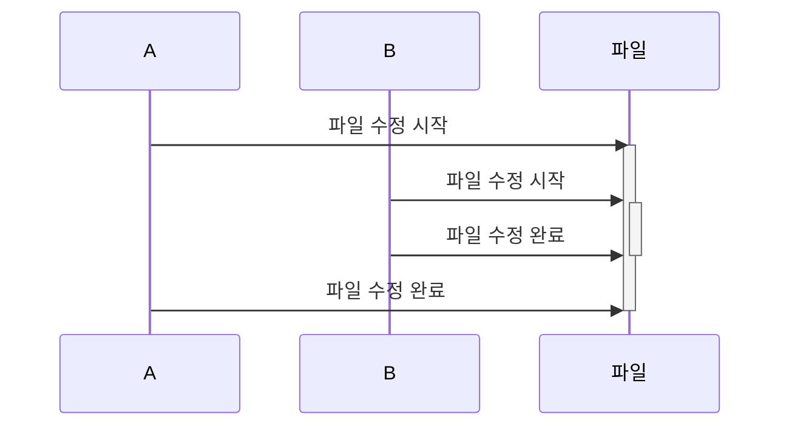
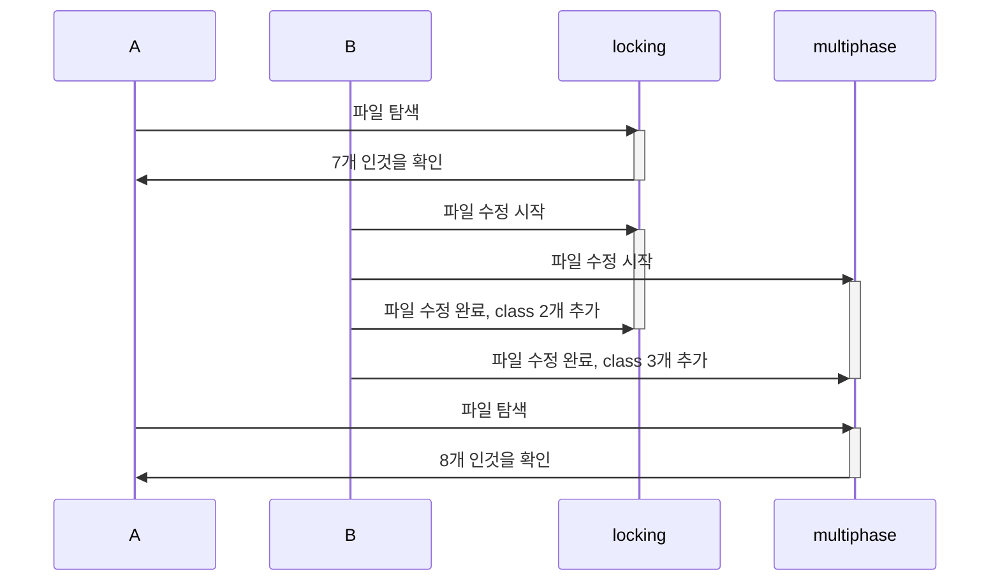

# 5장 - 동시성

- 동시성은 여러 프로세스나 스레드가 동일한 데이터를 조작하는 경우 필연적으로 발생한다.
- 테스트도 쉽지 않음
- 트랜잭션은 동시성의 여러 측면을 예방하는 프레임워크를 제공한다. 트랜잭션 내에서 데이터 조작을 수행하면 심각한 문제는 대부분 예방한다.
- 단일 데이터베이스 트랜잭션에 넣을 수 없는 시스템과 상호작용이 많기 때문에 완전히 무시할 수 있진 않다.
- 데이터가 여러 트랜잭션에 걸쳐 조작되는 경우 개발자가 직접 동시성을 관리해야한다.
  - offline concurrency

## 동시성 문제

### 손실된 업데이트 (lost update)

- A가 checkConcurrency 메서드를 변경하기 위해 수정하고있음
- A가 수정하는 동안 B가 같은 파일의 update 메서드를 수정하고 저장함
- A가 읽은 파일에선 B가 작업한 내용이 포함되지 않아 파일 수정본을 저장하면 B가 작업한 내용을 덮어쓰므로 사라진다.

### 일관성 없는 읽기 (inconsistent read)

- A가 동시성 패키지에 포함된 클래스 개수를 알아보고 있음
- 잠금locking, multiphase에 대한 하위 패키지 2개가 포함돼 있음
- locking 패키지의 class가 7개 인것을 확인
- A가 다른일을 하는동안 B가 four-phase lock code에 있던 버그를 해결하고 locking 패키지에 class 2개를 추가 후 원래 클래스가 5개였던 multiphase 패키지에는 클래스 3개를 추가함
- A가 multiphase 패키지에 클래스가 8개 인 것 을 확인하고 총 개수가 15개라고 결론내림

- 업데이트 전에는 12개이고 후에는 17개임.

> 이 두 문제는 정확성(또는 안전성)을 위반함.
> 하지만 정확성만 위반하지 않도록 한다면 문제가 그리 심각하지 않을 수 있음.
> 한번에 한 사용자만 데이터를 사용할 수 있게 하면됨
> -> 그러나 이 방법은 동시작업이 얼마나 많이 진행될 수 있는지를 나타내는 **활동성**을 충족하지 못하기 때문에 좋지 않을 수 있음
>
> 경우에 따라 정확성을 일부 양보하더라도 활동성을 향상시키는 겨웅도 있음.

## 실행 컨텍스트

- 외부 세계와 상호작용하는 관점에서 두중요한 두 가지 컨텍스트로 요청과 세션이 있음.

### 요청

- 소프트웨어가 작업하고 선택적으로 응답을 보내야 하는 외부 세계로부터의 단일 호출
- 처리는 대부분 서버 영역에서 수행되고 클라이언트는 응답을 기다리며 대기함
- 일부 프로토콜에서는 클라이언트가 응답을 받기 전에 요청을 가로챌 수 있도록 허용함 (드뭄)
  - 이보다는 클라이언트가 원래 요청을 방해할 수 있는 다른 요청을 보내도록 허용함
    - 주문 요청을 보낸 후 주문을 취소하는 다른 요청을 보냄

### 세션

- 클라이언트와 서버 간에 오랫동안 실행되는 상호작용
- 한 요청만 포함할 수 있지만 사용자가 하나의 일관된 논리적 흐름으로 생각하는 일련의 요청으로 이뤄지는 경우가 많음
- 일반적으로 사용자의 로그인으로 시작해 쿼리를 실행하거나 하나 이상의 트랜잭션을 수행하는 등의 작업을 포함함
- 로그아웃하면 세션이 끝남

### 프로세스

- 사용하는 내부 데이터에 대한 다단계 격리를 제공하는 대규모 실행 컨텍스트

### 스레드

- 한 프로세스 내에서 여러 스레드로 작동할 수 있게 구성된 소규모 활성 에이전트
- 한 프로세스 안에서 여러 요청을 지원할 수 있어 효율적 자원 활용에 도움됨
- 메모리를 공유하기때문에 동시성 문제를 유발할 수 있음

실행컨텍스트는 생각과 다르게 깔끔하게 정리되지 않는다.

- 각 세션은 전체 수명 동안 한 프로세스와 독점적 관계를 맺는다. 프로세스는 서로 확실하게 격리 되므로 동시성 충돌을 줄임
  - 이렇게 작동하지 않음.
  - 각 요청마다 새 프로세스를 시작하는 방식이 그나마 가장 비슷함
    - 구림. 리소스 너무 많이씀
  - 한 프로세스가 한 번에 한 요청만 처리하게 하는 시스템은 상당히 흔하면 이렇게만 해도 여러 동시성 문제를 예방할 수 있다.

### 데이터베이스 트랜잭션

- 단일 요청인 것처럼 처리하고 싶은 여러 요청을 하나로 처리할 수 있음

## 격리, 불변성

동시성 문제는 프로세스나 스레드와 같은 활성 에이전트가 동시에 둘 이상 동일한 데이터에 접근할 때 발생함

### 격리

- 격리를 통해 데이터를 분리함으로써 하나의 활성 에이전트만 데이터에 접근 가능하도록함
  - 프로세스는 운영체제 메모리에서 이와 비슷하게 작동함
    - 운영체제에서 단일 프로세스에 독점적으로 메모리를 할당하여 격리시켜버림
    - 한 사용자가 파일을 열면 다른 사용자는 파일을 열 수 없게 해버릴 수 있음
      - 또는 읽기전용으로 열 수 있지만 변경은 못함
- 오류 발생 가능성을 낮추는 필수 기법 - 이러한 격리 환경을 만드는 방법을 찾고 이 환경 내에서 최대한 많은 프로그래밍 작업을 수행하는 것
  > 테넌트 구조가 이런걸 다루기 좋은 것 같음

### 불변성

- 동시성 문제는 데이터가 수정도리 수 있을 때만 발생함
- 변경 불가능하게 하면 충돌을 예방 가능함
- 변경 불가능하게 모든 데이터를 만들수는 없지만 일부 데이터를 불가능, 또는 최소한 거의 항상 불가능하게 만들면 충돌을 줄일 수 있다
- 다른 방법으로 데이터를 읽기만 하는 부분을 분리하고 데이터의 복사본을 사용하게 해서 동시성 제어로부터 자유롭게 작업한다

## 낙관적 동시성 제어와 비관적 동시성 제어

### 낙관적 동시성 제어 (optimistic lock)

- 두 사용자가 자유롭게 파일을 복사하고 편집할 수 있다.
- 먼저 작업을 완료한 사람은 문제없이 작업 내용을 커밋할 수 있지만 나중에 작업한 사람은 변경 내용이 충돌한다는 것을 감지하여 제어기능이 작동하고, 어떻게 해결할 것인지는 나중에 작업한 사람이 결정한다. (보통은 에러를 내는경우가 많고, 깃같은건 conflict 같은걸로 해결하는 것 같다.)

### 비관적 동시성 제어 (pessimistic lock)

- 먼저 파일을 체크아웃하면 다른사용자가 작업을 완료하고 변경을 제출할 때까지 파일을 사용할 수 없게된다.

### 결론

- 낙관적 잠금 === 충돌 감지
  - 충돌이 발생했을 때 해결하는 방법
    - 비즈니스가 복잡해질수록 자동병합이 너무 어려울 수 있기 때문에 변경 내용을 모두 포기하고 처음부터 다시 편집해야하는 경우가 많을 수 있음.
- 비관적 잠금 === 충돌 예방
  - 동시성이 제한됨
  - 누군가 작업하고있으면 다른 모든 사용자가 제한됨

### 선택 기준

**충돌의 빈도**와 **심각도**

- 충돌이 자주 발생하지 않거나 결과가 그렇게 심각하지 않음
  - 낙관적 잠금
    - 더 나은 동시성을 제공하고 구현이 쉬움 (구현이 쉬운지는 미지수)
- 충돌의 결과가 심각한 경우
  - 비관적 잠금

## 일관성 없는 읽기 예방

- 비관적 잠금의 읽기잠금과 쓰기잠금을 활용하면 해결 가능
  - 데이터를 읽으려면 읽기잠금(or shared lock)이 필요하며 데이터를 쓰려면 쓰기잠금 (or exclusive lock)이 필요하다.
  - 여러 사용자가 동시에 데이터에 읽기 잠금을 가질 수 있지만 읽기 잠금을 가진 사용자가 있으면 다른 사용자는 쓰기 잠금을 가질 수 없다. 쓰기 잠금을 가진 사용자가 있으면 다른 사용자는 어떤 잠금도 가질 수 없다.
- 낙관적 잠금의 충돌 감지 기능은 버전 표식을 기반으로 작동한다.
  - 타임스탬프, 순차 카운터일 수 있음
  - 읽은 모든 데이터의 버전 표식을 공유된 데이터와 비교하여 차이가 있으면 충돌이 있다는 뜻임.

> 모든 데이터에 대한 접근을 제어하면 충돌이나 그리 중요치않은 데이터에 대한 대기 때문에 문제가 발생할 수 있다.
>
> - 사용한 데이터와 단순히 읽는 데이터를 분리하면 부담을 줄일 수 있다.

    - 제품 선택 목록의 경우 변경을 시작 후 새 제품이 나와도 문제가 되지 않으나 청구서 작성을 위해 요약하는 청구서 내역은 중요함
    	- 용도를 세심히 분석해야함
    - 고객 주소의 우편번호는 문제가 없어보일 수 있으나 고객 주거지를 기준으로 세금이 계산되면 주소도 동시성 제어에 포함돼야 할 수 있다.
    	- 동시성 제어 대상을 구분하는 것 또한 어떤 방식을 사용하는 것과는 관계없이 중요한 작업이다.

- 임시 읽기를 이용하는 것
  - 읽은 모든 데이터에 `타임스탬프/읽기 전용` 라벨 을 붙인다.
  - db는 이 라벨을 기준으로 데이터를 반환함.
    - 지원하는 데이터베이스가 드물지만 소스코드 관리 시스템에서는 이 기능을 지원하기도 한다.
    - 데이터소스에서 변경의 전체 임시 내역을 제공해야함.
      - 참고: Snodgrass, Fowler TP

## 교착상태 (Dead Lock)

- A가 고객파일 편집, B가 주문파일 편집을 하고있음.
- A가 이 작업을 끝내려면 주문파일을 편집해야되는데 B가 주문파일 편집을 끝내려면 고객파일을 편집해야해서 서로 더이상 진행이 안되는 dead lock 상태에 걸림

### 해결

- dead lock 감지 소프트웨어 사용
  - 발생하면 희생자를 하나 골라서 작업을 포기하도록함
- 모든 잠금에 시간 제한을 둠
  - 시간제한이 초과되면 잠금과 작업이 모두 손실됨
    - 모두가 희생자

### 예방

- 작업을 시작할 때 필요한 잠금을 모두 얻게 하고 추가 잠금을 얻지 못하게 하면 에방 가능함
  > 다만 나는 이게 실무에서 가능하기엔 제한적으로 가능하지 않을까... 생각이 든다
- 사용자가 잠금을 얻는 순서에 대한 규칙을 지정한다.
  - 알파벳순으로 파일에 대한 잠금을 얻게 한다.
  - A가 주문파일에 대한 잠금을 얻은 후 고객 파일에 대한 잠금을 얻으려고 하면 알파벳순이 아니기때문에 불가능하게 함.
- A가 이미 가지고있는 잠금을 B가 얻으려고 하면 자동으로 B가 희생자가 되게 하는방법
  - 간단함
- 작업에 필요한 잠금을 모두 얻고 시간제한을 추가함
  - 보수적 방법

## 트랜잭션

- 동시성을 처리하는 가장 중요한 툴
- 시작점과 끝점이 모두 일관된 상태로 유지됨.
- 전체를 실행하거나 실행하지 않는, 양자택일 방식
  - 현금지급기에서 현금을 지급하기 전에는 고객의 계좌에서 예금을 인출해서는 안된다.

## ACID

### 원자성(Atomicity)

- 트랜잭션의 경계 안에서 수행되는 각 직업의 단계는 모두 성공적으로 완료되거나 롤백돼야 한다.
  - 부분 완료 x
    - 예금을 인출하고 지불계좌로 입금하려고 할 때, 예금 인출 후 서버가 종료되면 인출전 상태로 돌아간다.

### 일관성(Consistency)

- 시스템 자원은 트랜잭션 시작과 완료 시점에 모두 일관성 있고 손상되지 않은 상태여야 한다.

### 격리성(Isolation)

- 개별 트랜잭션의 결과는 트랜잭션이 성공적으로 커밋하기 전까지 다른 열려있는 트랜잭션에서 볼 수 없어야 한다.
  > READ UNCOMMITTED로 하면 볼 수 있지 않나?

### 지속성(Durability)

- 커밋된 트랜잭션의 결과는 영구적이어야한다.
  - 강제종료가 발생해도 유지돼야 한다.

## 트랜잭션 리소스

- 트랜잭션으로 동시성을 제어할 수 있는 모든 대상
  - db, queue, map 등
  - 이 책에서는 가장 일반적인 db로 한다.
- 처리량을 극대화 하기 위해 최신에는 최대한 짧게 유지되도록 설계된다.
  - 요청이 시작될 때 트랜잭션을 시작하고 요청이 끝날 때 트랜잭션을 끝내는 방법을 일반적으로 많이 사용된다 (`request transaction`)
- 트랜잭션을 최대한 늦게 여는 것
  - 트랜잭션 밖에서 모든 읽기를 수행하고 업데이트를 시작할 때 트랜잭션을 여는 방식 (`late transaction`)
  - 트랜잭션 시작 전까지 동시성 제어가 전혀 적용되지 않아 일관성 없는 읽기 문제 우려가 있음.
    - 충돌이 아주 심하거나 비즈니스 트랜잭션이 여러 요청에 걸쳐 어쩔 수 없이 사용해야 하는 경우가 아니면 잘 사용되지 않는다.
- 리소스가 어느정도 잠기는지 인식해야함.
  - 전체 테이블을 잠그는 경우 곤란해짐

## 활동성을 위한 트랜잭션 격리성 저하

### Serializable Transaction

- 완전히 격리가 가능함.
- 여러 트랜잭션을 동시에 실행해도 순서대로 실행했을 때와 동일한 결과를 얻을 수 있는 경우
- 가장 강력한 수준
  - 그 외 격리수준에서는 일관성 없는 읽기가 발생할 수 있음

### Repeatable read

- **phantom** 이 허용됨
- 컬렉션에 여러 요소를 추가했을 때 읽는 쪽에서 일부 요소만 볼 수 있는 현상
- 이전조회가 이후 조회의 데이터가 달라지는 현상

### Read committed

- 반복 불가능 읽기
- RDB에서 가장 일반적인 수준의 격리수준

### Read uncommitted

- dirt read
- 커밋되지 않은 데이터를 읽을 수 있음

> 정확성을 보장하려면 항상 serializable transaction을 사용하는게 좋지만 활동성이 크게 저하되므로 포기해야한다.

## Bussiness Transaction, System Transaction

- 시스템 트랜잭션은 RDB 시스템, 트랜잭션 모니터의 지원을 받아 운영된다.
- 시스템 트랜잭션은 비즈니스 시스템의 사용자에게는 전혀 의미가 없다.
  - 온라인 은행 시스템의 사용자에게 트랜잭션은 로그인, 계정 선택, 이체 내역 설정, 확인버튼을 눌러 금액을 이체하는 과정을 포함한다.
    - 이곳에서도 시스템 트랜잭션과 동일한 ACID 속성을 제공해야한다.
    - 금액을 이체하기 전 취소하면 이전 화면에서 수행한 모든 변경은 취소되야한다.
- long transaction을 사용해도 괜찮다면 사용해도 된다.
  - DB가 주요 병목지점이 되기 때문에 확장성 제약이 잇다.
- offline concurrency
  - 여러 트랜잭션 사이에서 비즈니스 트랜잭션의 ACID 특성을 지원하는 역할

## Offline Concurrency pattern

### 낙관적 오프라인 잠금

- 가장 쉽고 활동성이 가장 높음
- 비즈니스 트랜잭션이 실패하는 경우 커밋할 때가 돼서야 알 수 있어 불편함을 초래할 수 있음

### 비관적 오프라인 잠금

- 문제가 있으면 조기에 알아낼 수 있지만 프로그래밍하기 어렵고 활동성이 제한된다.

### 굵은 입자 잠금(Coarse-Grained Lock)

- 객체 그룹의 동시성을 함께 관리함
- 여러 객체에 대한 작므을 하나로 관리함

### 암시적 잠금

- 잠금을 직접 관리할 필요가 없어짐
- 애플리케이션이 암시적으로 처리함

## 애플리케이션 서버 동시성

### 세션별 프로세스

- 각 세션이 각자의 프로세스에서 실행되는 방식
- 완전히 격리되므로 다중 스레드에 대해 신경 쓸 필요가 없다.
- 리소스를 너무 많이 소모함

### 요청별 프로세스

- 일정 수의 세션을 처리하는 데 세션별 프로세스보다 훨씬 적은 수의 프로세스가 사용된다.
- 일정 수준의 부하를 처리하려면 프로세스를 많이 실행해야함

### 요청별 스레드

- 적은 하드웨어 리소스로 더 많은 요청을 처리해 서버의 효율을 높힘
- 메모리 공류를 하기 때문에 서로 격리되지 않음

> 필자는 요청별 프로세스를 추천한다.
>
> - 요청별 스레드보다 효율이 낮지만 충분하다.
> - 견고성 또한 더 우수
> - 이거 완전 파이썬...?
