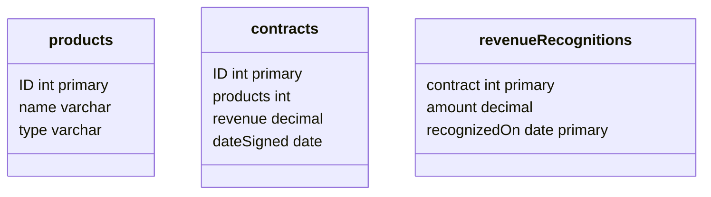

9장 - 도메인 논리 패턴

## 트랜잭션 스크립트

- 모든 논리를 단일 프로시저로 구성하고 데이터베이스를 직접 또는 씬 데이터베이스 래퍼를 통해 호출

### 작동 원리

- 도메인 로직은 주로 시스템에 대해 수행하는 트랜잭션으로 구성됨
  - 호텔 객실을 예약하는 경우 빈 객실 확인, 요금 계산, 데이터베이스 업데이트 등을 수행하는 로직은 호텔 객실 예약이라는 프로젝트로 안에 포함된다.
- 최대한 분리하는 것이 바람직함.
  - 적어도 별도의 서브루틴에 넣어야 함
- 여러 트랜잭션 스크립트를 한 클래스에 넣고 각 클래스에서 연관된 트랜잭션 스크립트의 주제 영역을 저으이하는 것

### 사용 시점

- 단순함
- 공통적인 코드가 중복되는 경향이 있음

### 수익 인식 문제

- 비즈니스 시스템의 공통 문제
- 수익을 어떤 시점에 실제로 수익으로 인정할 수 있느냐는 것
  - 커피를 파는경우 커피를 건네고 돈을 받는 순간
  - 내년 한 해 동안 컨설팅을 위한 상담료를 지불
    - 상담료가 오늘 지불되지만 1년동안 꾸준히 서비스를 제공해야 하므로 전체 상담료를 당장 수익으로 기록할 수 없음
      - 매월 1/12로 계산

### 예제

- 워드프로세서, 데이터베이스, 스프레드시트를 판매함
  - 워드프로세서는 모든 수익을 즉시 계산
  - 스프레드시트는 수익의 1/3을 즉시, 1/3을 60일 후, 1/3을 90일 후 계산
  - 데이터베이스는 수익의 1/3을 즉시, 1/3을 30일 후, 1/3을 60일 후 계산
- 상품, 계약, 수익인식을 각각 저장하는 테이블 3개
- 특정 계약의 수익 인식을 계산
- 특정 계약에서 특정 날짜까지 인식되는 수익



- 특정 계약에서 특정 날짜까지 인식되는 수익

```java
class Gateway {
  ...
  public ResultSet findRecogntitionsFor(long contractID, MfDate asof) throws SQLException {
    PreparedStatement stmt = db.prepareStatement(findRecognitionsStatement);
    stmt.setLong(1, contractID);
    stmt.setDate(2, asof.toSqlDate());
    ResultSet result = stmt.executeQuery();
    return result;
  }

  private static final String findRecognitionStatement =
  "SELECT amount " +
  " FROM revenueeRecognitions " +
  " WHERE contract = ? AND rexognizedOn <= ?";

  private Connection db;
}
```

```java
class ReognitionService {
  ...
  public Money recognizedRevenue(long contractNumber, MfDate asOf) {
    Money result = Money.dollars(0);
    try {
      ResultSet rs = db.findRecognitionsFor(contractNumber, asOf); // gateway 메서드 아님?
      while (rs.next()) {
        result = result.add(Money.dollars(rs.getBigDecimal("amount")));
      }
      return result;
    }catch(SQLException e) {
      throw new ApplicationException(e);
    }
  }
}
```

- 수익인식 계산

```java
class RecognitionService {
  ...
  public void caluclateRevenueRecognitions(long contractNumber) {
    try{
      ResultSet contracts = db.findContract(contractNumber);
      contracts.next();
      Money totalRevenue = Money.dollars(contracts.getBigDecimal("revenue"));
      MfDate recognitionDate = new MfDate(contracts.getDate("dateSigned"));
      String type = contrats.getString("type");

      if (type.equals("S")){
        Money[] allocation = totalRevenue.allocate(3);
        db.insertRecognition(contractNumber, allocation[0], recognitionDate);
        db.insertRecognition(contractNumber, allocation[1], recognitionDate.addDays(60));
        db.insertRecognition(contractNumber, allocation[2], recognitionDate.addDays(90));
      } else if (type.Equals("W")) {
         db.insertRecognition(contractNumber, totalRevenue, recognitionDate);
      }
      } else if (type.equals("D")) {
        Money[] allocation = totalRevenue.allocate(3);
        db.insertRecognition(contractNumber, allocation[0], recognitionDate);
        db.insertRecognition(contractNumber, allocation[1], recognitionDate.addDays(30));
        db.insertRecognition(contractNumber, allocation[2], recognitionDate.addDays(60));
      }
    }catch (SQLException e) { throw new ApplicationException(e);
    }
  }
}
```

테이블 데이터 게이트웨이

```java
class Gteway {
  ...
  public ResultSet findContract (long contractId) throw SQLException{
    preparedStatement stmt = db.prepareStatement(findContractStatement);
    stmt.setLong(1, contractId);
    ResultSet result = stmt.executeQuery();
    return result;
  }

  private static final String findContractStatement =
    "Select * " + " FROM contracts c, products p " + " WHERE ID = ? AND c.product = p.ID"
}
```

> 음... 이게 왜 테이블 데이터 게이트웨이...?

## 도메인 모델

도메인 모델이 동작도 모두 포함함

### 작동 원리

- 도메인 모델은 데이터와 프로세스가 혼합된 구조
- 다중값 속성과 복잡한 연결망, 상속을 사용

### 예제

```java
class RevenueRecognition {
  ...
  private Money amount;
  private MfDate date;

  public RevenueRecognition(Money amount, MfDate date) {
    this.amount = amount;
    this.date = date;
  }

  public Money getAmount() {
    return amount;
  }

  boolean isRecognizableBy(MfDate asOf) {
    return asOf.after(date) || asOf.equals(date);
  }
}
```

- 특정 날짜까지 인식된 수익 계산

```java
class Contract {
  ...
  private List revenueRecognitions = new ArrayList();

  public Money recognizedRevenue(MfDate asOf){
    Money result = Money.dollars(0);
    Iterator it = revenueRecognitiosn.iterator();
    while (it.hasNext()) {
      RevenueRecognition r = (RevenueRecognition) it.next();
      if(r.isRecognizableBy(asOf)){
        result = result.add(r.getAmount());
      }
    }
    return result;
  }
}
```

- 여러 클래스가 상호작용함
- 그 이후 예제는 생략하겠음.
- 객체 -> 객체로 전달하는 동작을 처리하기에 가장 적절한 객체로 이동할 뿐 아니라 조건부 동작도 대부분 해결됨

## 테이블 모듈

- 도메인 모델은 주문의 수만큼 객체를 사용하지만 테이블 모듈은 모든 주문을 객체 하나가 처리함
- 스킵하겠음

## 서비스 계층

- 트랜잭션 제어
- 응답 조율
- 어플리케이션의 비즈니스 논리를 캡슐화

### 작동 원리

- 애플리케이션 논리를 순수 도메인 객체 클래스에 넣으면 두 가지 부작용이 있다.
  - 도메인 객체 클래스가 특정 애플리케이션 논리를 구현하고, 특정 애플리케이션 패키지를 사용하면 도메인 객체 클래스를 다른 애플리케이션에서 재사용하기 어려워진다.
  - 두 가지 종류의 논리를 동일한 클래스에 넣으면, 예를들어 나중에 애플리케이션 논리를 워크플로 툴로 분리할 필요가 있을 때 다시 구현하기 어렵다
- 비즈니스 논리를 별도의 계층으로 분리함으로써 계층화의 장점을 제공하고 순수 도메인 객체 클래스를 애플리케이션 간에 재사용하기 쉽게 만들어 준다.

#### 구현의 변형

- 도메인 파사드 (doamin facade)
  - 서비스 계층을 도메인 모델 위에서 씬 파사드으 ㅣ집합으로 구현
  - 비즈니스 논리를 전혀 구현하지 않으며 도메인 모델이 모든 비즈니스 논리를 구현한다.
  - 클라이언트 계층이 애플리케이션과 상호작용하기 위한 작업 집합과 경계를 형성
- 작업 스크립트 (operation script) - 서비스 계층을 리치 클래스 집합으로 구현 - 애플리케이션 논리는 직접 구현, 도메인 논리는 캡슐화된 도메인 객체 클래스로 위임
  > 애플리케이션 논리가 뭔데

#### 원격 호출 고려

- 굵은 입자 인터페이스
- 로컬로 호출할 수 있고 도메인 객체를 받는 메서드 시그니처를 사용하는것으로 시작 -> 추후 원격 인터페이스 구현

#### 서비스 및 작업 식별

- 사용자 인터페이스
  - CRUD의 경우가 많음

### 예제

```java
public class ApplicationService {
  proected EmailGateway getEmailGateway() {
    //EmailGateway 인스턴스 반환
  }

  protected IntegrationGateway getIntegrationGateway() {
    //IntegrationGateway 인스턴스 반환
  }
}

public interface EmailGateway {
  void sendEamiilMessage(String toAddress, String subject, String body);
}

public interface IntegrationGateway {
  void publishRevenueRecognitionCalculation(Contract contract);
}

public class RecognitionService extends ApplicationService {
  public void calculateRevenueRecognitions(long contractNumber){
    Contract contract = Contract.readForUpdate(contractNumber);
    contract.calucateRecognitions();
    getEmailGateway().sendEmailMessage(contract.getAdministratorEmailAddress(), "RE: Contract #" + contractNumber, contract + " has had revenue recognitions calculated.");
    getIntegrationGateway().publishRevenueRecognitionCalculation(contract);
  }
public Money recognizedRevenue(long contractNumber, Date asOf) {
  return Contract.read(contractNumber).recognizedRevenue(asOf);
}
}
```
